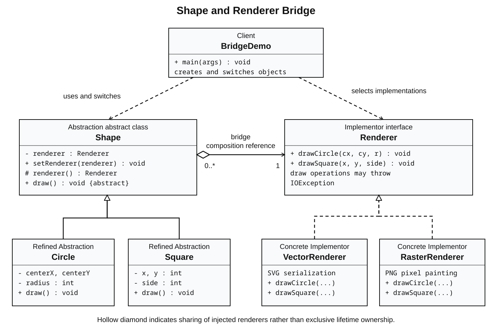

# Assignment 3 — Bridge Pattern

Java 17 implementation for ShP-2216 Software Design Patterns, Astana IT University.
Topic: **Shape × Renderer**. `Circle` and `Square` share a replaceable `Renderer` reference;
`VectorRenderer` writes real SVG files and `RasterRenderer` writes real PNG files.

Repository: https://github.com/Ziyadin23/assignment-3-bridge-pattern

## Requirements and run

Install **JDK 17** (not only a JRE). No Maven, Gradle, or external Java libraries are needed.
From the repository root on Linux/macOS or Git Bash:

```bash
./run.sh
./test.sh
```

If JDK 17 is not on PATH, set `JAVA_HOME` to its installation directory first.
Compilation uses `--release 17`, UTF-8, and treats all compiler warnings as errors.
The program works headlessly; a graphical desktop is not required.

### IntelliJ IDEA

1. Open this folder and select JDK 17 as the project SDK and language level.
2. Mark `src/main/java` as Sources Root and `src/test/java` as Test Sources Root.
3. Run `edu.aitu.bridge.BridgeDemo` and `edu.aitu.bridge.BridgeTests`.
4. Open the generated files in `rendered/vector` and `rendered/raster`.

### Windows PowerShell without Bash

```powershell
New-Item -ItemType Directory -Force build/classes | Out-Null
$sources = Get-ChildItem src -Recurse -Filter *.java | ForEach-Object { $_.FullName }
javac --release 17 -encoding UTF-8 -Xlint:all -Werror -d build/classes $sources
java -Djava.awt.headless=true -cp build/classes edu.aitu.bridge.BridgeDemo
java -Djava.awt.headless=true -cp build/classes edu.aitu.bridge.BridgeTests
```

## Runtime demonstration

```text
1. Draw Circle and Square with VectorRenderer
2. Switch the SAME shape objects to RasterRenderer
3. Switch the SAME shape objects back to VectorRenderer
Complete: circle.svg, square.svg, circle.png, square.png
Output directory: <absolute path to rendered>
```

The `List<Shape>` is constructed only once. `setRenderer` changes each object's backend;
its geometry and identity are retained. All four combinations are demonstrated:
Circle–Vector, Square–Vector, Circle–Raster, Square–Raster.
An optional output directory can be supplied: `./run.sh path/to/output`.

## Structure and pattern roles

```text
src/main/java/edu/aitu/bridge/
  Shape.java            Abstraction and the composition reference
  Circle.java           Refined Abstraction
  Square.java           Refined Abstraction
  Renderer.java         Implementor interface
  VectorRenderer.java   Concrete Implementor for SVG
  RasterRenderer.java   Concrete Implementor for PNG
  RenderTarget.java     Shared output configuration and directory handling
  BridgeDemo.java       Client and runtime switching
src/test/java/edu/aitu/bridge/
  BridgeTests.java      Seven behavioral test groups, no test framework required
docs/
  report.docx           Submission report
  uml.svg               UML diagram suitable for browser viewing
  uml.png               UML diagram suitable for document insertion
  bridge.puml           Editable PlantUML source
  defense-guide.md      Walkthrough and likely instructor questions
```



The horizontal reference from `Shape` to `Renderer` is the bridge. Shape inheritance
and renderer interface implementation form separate hierarchies. The diagram uses
shared aggregation: a renderer can be injected into multiple shapes. “Composition”
in the pattern means holding and delegating through an object reference; it does not
require exclusive UML lifetime ownership.

## Clean Code and extension

The report explains six principles with annotated excerpts: separation of responsibilities,
meaningful names, small methods, removing repeated output handling, depending on a stable
interface, and validating invariants. A third renderer only implements `Renderer`; existing
shape code stays unchanged. The tests use a `RecordingRenderer` to verify this.

Adding a shape expressible using existing primitives does not change renderers. A genuinely
new primitive, such as a triangle, requires extending `Renderer` and every implementation.
The current shape-specific interface intentionally trades broader extensibility for simplicity.

## Output contract and limits

Each draw creates a blue filled shape on a white **320 × 320** canvas. Repeated draws of the
same shape type overwrite that backend's file. Coordinates outside the canvas are clipped;
positive dimensions are required, but position need not be within the viewport. The demo's
geometry fits within the canvas. Renderers are intended for sequential use, not concurrent
writes to the same directory. I/O failures propagate as `IOException` rather than being hidden.

## Verification

`BridgeTests` verifies unchanged delegation of geometry; renderer replacement and switching
back on existing objects; invalid input handling; parsed SVG coordinates; readable PNG size,
interior/background pixels and distinct shape geometry; output failure propagation; and the
complete demo's four output files. Tests use temporary directories and remove them afterward.

## Submission and defense

Upload `docs/report.docx` and this public repository link to Moodle before the Week 4 deadline.
Confirm the exact date from the course's Moodle calendar; the instructions give no calendar date.
Read `docs/defense-guide.md`, practice running the demo, and attend the final practice class of
Week 5. Be able to explain every class and the actual runtime switch in your own words.

## Sources

- Assignment 3 Bridge Pattern Instructions, supplied course document.
- [Refactoring.Guru — Bridge](https://refactoring.guru/design-patterns/bridge).
- [Refactoring.Guru — Adapter](https://refactoring.guru/design-patterns/adapter).

This repository contains an assignment-specific implementation, rather than copied tutorial code.
